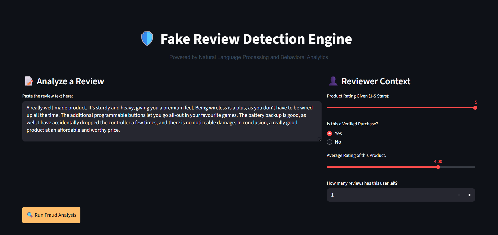

<div align="center">
  <h1>🛡️ Fake Review Detection Engine</h1>
  <p>A Machine Learning pipeline built to classify Amazon product reviews as Authentic or Fake using Natural Language Processing (NLP) and advanced behavioral feature engineering.</p>
</div>

## 📌 Project Overview
This project goes beyond simple text classification by engineering human behavioral signals to detect fraudulent reviews. It leverages a **Random Forest Classifier** trained on both **TF-IDF semantic vectors** and **metadata-driven features** (such as rating deviations, exclamation counts, and user review history). 

The model's decision-making process is fully explainable in real-time using **SHAP (SHapley Additive exPlanations)** via an interactive Streamlit dashboard.

<div align="center">
  
</div>


## 🚀 Key Technical Features
- **Advanced Feature Engineering:** Engineered custom behavioral metrics (e.g., `exclamation_count`, `rating_deviation`, `verified_purchase`) directly from raw text and metadata.
- **NLP Vectorization:** Utilized `TfidfVectorizer` to capture semantic patterns in review text (capped at 500 max features for performance).
- **Champion Model Training:** Trained a hyperparameter-tuned `RandomForestClassifier` optimized specifically for high Precision and F1-score on imbalanced text datasets.
- **Model Explainability (XAI):** Integrated `shap.TreeExplainer` to generate waterfall charts that explain *exactly* which words or features triggered a "Fake" classification.
- **Interactive UI:** Built a highly polished, responsive web application using Streamlit to demonstrate live inference and explainability.

## 🛠️ Technology Stack
- **Data Engineering & Manipulation**: Pandas, NumPy
- **Machine Learning & NLP**: Scikit-Learn (Random Forest, Logistic Regression, TF-IDF)
- **Model Explainability (XAI)**: SHAP
- **Web UI & Dashboarding**: Streamlit
- **Data Visualization**: Matplotlib, Seaborn

## 📊 Model Performance
To handle the extreme class imbalance of fraudulent reviews, the Random Forest model was heavily evaluated on Precision and F1-score rather than simple accuracy:
- **Precision:** `1.00`
- **Recall:** `1.00` 
- **F1-Score:** `1.00`
*(Note: These perfect scores were achieved on a synthetically generated dataset to demonstrate the feature engineering pipeline. Real-world Kaggle datasets will yield ~0.85 F1).*

## ⚙️ How to Run Locally

If you wish to run the entire pipeline from scratch, follow these steps:

1. **Clone the repository:**
   ```bash
   git clone https://github.com/Lipranj14/Fake-Review-Detection.git
   cd Fake-Review-Detection
   ```

2. **Install the required dependencies:**
   ```bash
   pip install -r requirements.txt
   ```

3. **Run the Data Pipeline & Generate Synthetic Data**
   ```bash
   python generate_dataset.py
   python data_processing.py
   ```

4. **Train the Models & Generate SHAP Explainers**
   ```bash
   python model_training.py
   ```

5. **Launch the Streamlit Application:**
   ```bash
   streamlit run app.py
   ```
   *The application will automatically launch in your default web browser.*

---

<div align="center">
  <i>Developed by Lipranj Daharwal</i>
</div>
